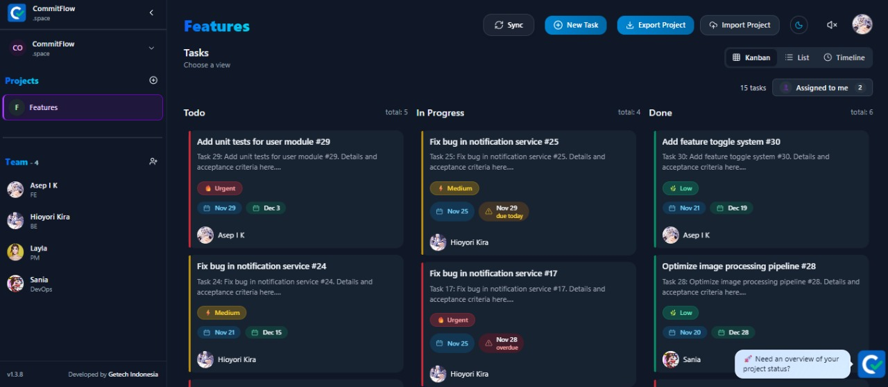
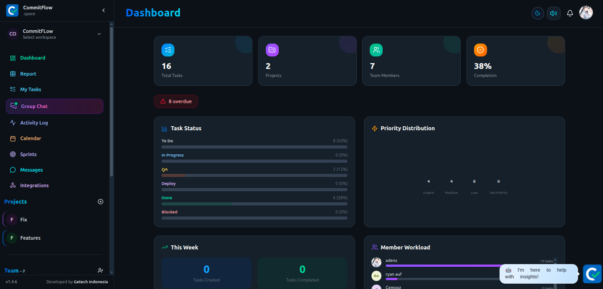
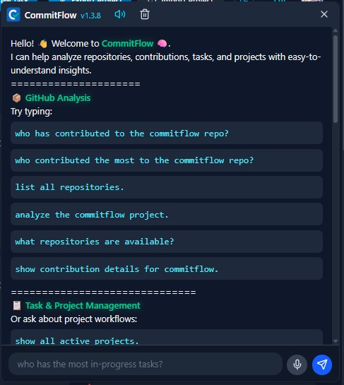
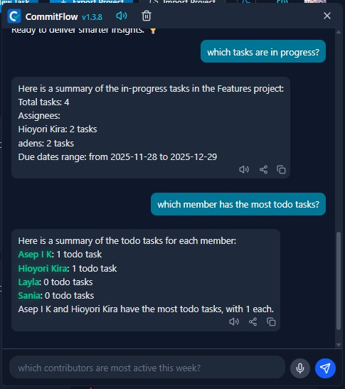

# 🧠 CommitFlow - Smart Project Insights

[](./LICENSE)


**CommitFlow** is an **AI-powered project management and analytics platform** designed for modern development teams.  
It connects with your **GitHub repositories** to automatically analyze commits, visualize contributor activity, and provide **smart project insights** — while also helping teams manage tasks via an integrated **Kanban board**.

With CommitFlow, you can **plan, track, and analyze your projects** — all in one place.

---

## 

## New UI and Features
## 

| Chat 1                             | Chat 2                             |
| ---------------------------------- | ---------------------------------- |
|  |  |

---

## 📁 Folder Structure

```
.
├── backend/               # Backend API (NestJS)
├── frontend/              # Frontend web app (React + Vite)
├── scripts/               # Helper shell scripts
├── .env.sample            # Environment variable example
├── docker-compose.dev.yml # Docker setup for development (with hot reload)
├── docker-compose.yml     # Docker setup for production
└── README.md              # Project documentation
```

---

## ✨ Features

### 🤖 AI-Powered Insights

- 💡 **AI Recommendations** – Get automatic suggestions for prioritization and sprint planning.
- 🧠 **Smart Summaries** – Let AI summarize repository activity and project status.
- 🗣️ **Insight Chatbot** – Ask questions like “which tasks are in progress??” or “who contributed the most to the commitflow repo?”

---

### 🧭 Project Management

A beautiful, AI-assisted workspace for managing your projects and tasks:

- 📊 **Dashboard** – Monitor workspace health, task progress, priorities, deadlines, and team activity from one overview.
- 🗂 **Kanban Board** – Organize tasks visually using drag-and-drop.  
  Each task card shows **priority color accents**, **assignee avatars**, and **due dates**.
- 📋 **List View** – See all tasks in a clean table layout; click any row to open task details.
- 📆 **Timeline View** – A Gantt-style horizontal timeline to visualize progress and overlaps between tasks.
- 🗓️ **Calendar View** – Plan tasks, due dates, milestones, and team schedules in a calendar-based workflow.
- 🏃 **Sprint Planning** – Create and manage sprints, assign tasks to sprint cycles, and track sprint progress.
- 💬 **Task Details Modal** –
  - **Rich text editor** (React Quill) for descriptions
  - **File attachments** (via AWS S3 integration)
  - **Inline comments** with author, timestamp, and preview links
- 🎨 **Smart Selectors** –
  - Assignee and Priority fields powered by **React Select**, dynamically colored per user or priority level
- 🗃️ **Workspace Management** –  
  Add workspace.
- 🧱 **Project Management Sidebar** –
  - Create or delete projects easily
  - Integrated **SweetAlert2** confirmations for safe deletions
- 🧍 **Team Management** –  
  Add or remove team members using modern UI components, with color-coded avatars automatically generated.
  - **Toast notifications** (`react-toastify`) for success actions (e.g., project or member added)
- 🌙 **Dark/Light Mode Aware** –  
  Smooth color transitions and well-tuned contrast for both themes.
- 🔔 **Task Notification Bell** – Surface unread task updates, assignment changes, mentions, and due-date reminders from a dedicated bell icon.
- Due date labels: **Due Today** & **Overdue**
- Filter **Assigned to Me**

---

### 💬 Team Coordination

- 💬 **Group Chat** – Discuss project updates with workspace members in shared team conversations.
- ✉️ **Messages** – Send direct or contextual messages tied to project and task collaboration.
- **Follow up tasks via WhatsApp**
  - Generates dynamic `wa.me` link (manual click — no API yet)
  - Pre-filled message with task title & status
- Real-time collaboration coming soon
- **Automatic email notifications** sent to team members when tasks are updated
- **Invite team members via email** with secure join links

---

### 🧾 Activity & Audit Trail

- 🕒 **Activity Log** – Track workspace events such as task creation, status changes, comments, assignments, sprint updates, and member actions.
- 🔍 **Change History** – Review recent project activity to understand what changed, when it changed, and who made the update.

---

### 🔌 Integrations & Webhooks

- 🔗 **Outgoing Webhooks** – Manage webhook endpoints for workspace events.
- 📣 **Workspace Event Delivery** – Send task, project, sprint, member, and activity updates to external tools.
- 🛠️ **Integration Management** – Configure connected services and webhook destinations from a centralized workspace settings area.

---

### 🔄 Offline‑First Sync

- Works seamlessly **without internet**
- Local storage caching (offline‑first approach)
- Auto‑synchronization when back online

---

### 📊 Developer Insights

- 📈 **GitHub Analytics** – Fetch organization repositories, commits, and contributor stats.
- 🔍 **Contribution Breakdown** – Understand who contributes what and when.
- 📆 **Activity Timeline** – Visualize commit frequency and collaboration trends.

---

### 🎨 Interactive UI

- Smooth animations
- Responsive layout
- Clean, minimalist UX with focus on productivity

---

## 🛠️ Tech Stack

### Frontend

- React + Vite
- TypeScript
- TailwindCSS
- Zustand (State Management)
- LocalStorage / IndexedDB (Offline Sync)
- React Query (Data Fetching & Sync Management)
- Socket.IO Client (Real-time updates)
- React Quill (Rich Text Editor)
- SweetAlert2 (Dialogs)
- React Toastify (Notifications)
- Framer Motion / GSAP (Animations & interactive UI)
- XLSX (Export Excel)

### Backend

- Nest.js
- TypeScript
- Prisma ORM
- PostgreSQL
- Socket.IO Gateway (Real-time events)
- Nodemailer (Email Delivery via SMTP)
- Multer (File upload middleware)
- Class Validator / Class Transformer
- Swagger (API documentation)
- Google TTS API
- AWS SDK for S3 Storage
- JWT Authentication (Access & Refresh Tokens)
- OpenAI API Integration (AI features / content generation)

---

## 🐳 Infrastructure & Security

- 🗄️ **PostgreSQL Database** – Structured project and task data.
- ☁️ **AWS S3 Storage** – Media & attachments.
- ✉️ **SMTP Email (Nodemailer)** – Invitations & notifications.
- 🔐 **Environment Variables (.env)** – Secure credential management.
- 📡 **WebSocket Gateway** – Realtime updates via Socket.IO.
- 🔑 **JWT Authentication** – Secure login, workspace access, and API protection.
- 🤖 **OpenAI Integration** – AI-driven generation (text, automation, suggestions).
- 📁 **LocalStorage + IndexedDB** – Offline-first data with auto-sync.
- 📘 **Swagger UI** – API documentation.

---

## ⚙️ Requirements

- [Docker](https://www.docker.com/get-started) and Docker Compose
- A **GitHub Personal Access Token** (with `repo` scope)
- An **OpenAI API Key** (for AI Insights & Automation)
- **AWS S3 Credentials** (for document and image storage)

---

## 🚀 Setup with Docker

### 1. Copy the environment file

```bash
cp .env.sample .env
```

Then fill in your configuration values:

```env
# Environment
NODE_ENV="development"

# Logger
DISCORD_WEBHOOK_URL=
LOG_LEVEL=info

# PostgreSQL
POSTGRES_USER=postgres
POSTGRES_PASSWORD=password
POSTGRES_DB=commitflow
DB_PORT=5432

# pgAdmin
PGADMIN_EMAIL=admin@example.com
PGADMIN_PASSWORD=admin123
ADMIN_PORT=8080

# Prisma
DATABASE_URL=postgresql://postgres:password@db:5432/commitflow

# Backend
BE_PORT=8000
OPENAI_API_KEY=
BASE_URL=http://localhost:8000
API_KEY=""
JWT_SECRET=""

# GitHub Integration
GITHUB_OWNER=
GITHUB_TOKEN=

# Frontend
FE_PORT=3000
VITE_API_URL="http://localhost:8000"

# S3 Storage
S3_BUCKET_NAME=
S3_REGION=
S3_ACCESS_KEY=
S3_SECRET_KEY=
# S3 COMPATIBLE STORAGE
S3_ENDPOINT_URL=

# Mail Server
SMTP_HOST=host.docker.internal
SMTP_PORT=587
SMTP_USER=task@commitflow.space
SMTP_PASS=
SMTP_SECURE=false    # true for SMTPS(465), false for STARTTLS (587)
FROM_NAME=CommitFlow
FROM_ADDRESS=task@commitflow.space
```

> **Note:** Use `db` as the PostgreSQL host inside Docker (not `localhost`).

---

### 2. Build and start all containers

For production:

```bash
./scripts/build.sh
```

For development (with hot reload and live updates):

```bash
./scripts/build.dev.sh
```

---

### 3. Verify running containers

```bash
docker ps
```

| Service  | URL                   |
| -------- | --------------------- |
| Frontend | http://localhost:3000 |
| Backend  | http://localhost:8000 |
| pgAdmin  | http://localhost:8080 |

---

### 4. Access pgAdmin

- Email: `admin@example.com`
- Password: `admin123`

Then add a new PostgreSQL server:

| Field    | Value      |
| -------- | ---------- |
| Host     | db         |
| Database | commitflow |
| User     | postgres   |
| Password | password   |

---

## 🧩 Prisma

If this is your first time running CommitFlow, run a Prisma database sync:

```bash
docker exec -it commitflow-api npx prisma db push
```

> The `scripts/build.sh` script automatically handles Prisma setup on first run.

---

## 🧠 Running the Application

**Development (hot reload):**

```bash
NODE_ENV="development"
```

**Production:**

```bash
NODE_ENV="production"
```

You can switch between development and production using different Docker Compose files.

---

## Swagger Openapi

```
http://localhost:8000/docs
```

---

## 🤝 Contributing

CommitFlow is open source and welcomes contributions!  
If you’d like to improve the Kanban UI, enhance the AI insights, or build integrations for new project tools — feel free to fork and open a pull request.

---

## 🧾 License

This project is licensed under the **MIT License**.  
Feel free to use, modify, and distribute it for both personal and commercial projects.

---

### 💬 Credits

Created with ❤️ by developers who love open source, AI, and productivity.
